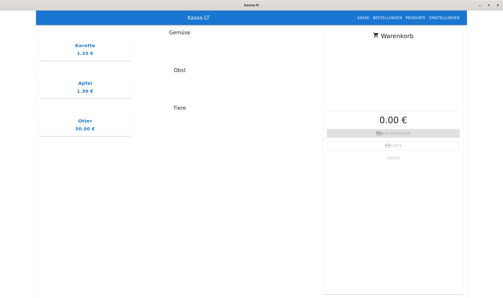

# Kassa-LT

Kassa-LT is a point-of-sale (POS) application to use on a single device.

It uses a Vite frontend and a Rust backend, bundled using Tauri to create a single, cross-plattform application.

## Build
You can use the Makefile for common build tasks:
- Run the development environment using `make dev`
- Run the unit tests using `make test`
- More to be expanded

### Release versions
You can create executables according to https://tauri.app/distribute/, right now it is only tested for Windows NullSoftInstaller and Android.
These can be created using `make release-windows` and `make release-android` respectively.
## Development

### WebDAV backup

To test the backup feature locally, run `docker compose up` to start a WebDAV server.
The app needs to be configured with the following settings:

* **WebDAV URL**: `http://localhost:8080`
* **Username**: `alice`
* **Password**: `secret1234`
* **Auth Method**: `Digest`

To check for successful backups, visit [http://localhost:8080](http://localhost:8080) in a web browser.
